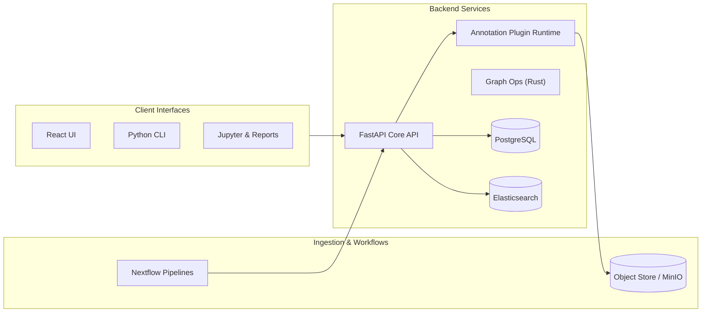

# PanGenome Insight Platform (PGIP)

The PanGenome Insight Platform (PGIP) is an open-source, extensible toolkit for interpreting genetic variation across linear and graph-based references. It brings variant annotation, expression overlays, protein context, and machine-learning predictions together under a unified, provenance-aware API. The long-term goal is to maintain a living reference implementation that bioinformatics students and researchers can extend with new plugins, datasets, and visualizations.

## Vision

- **Graph-first**: Treat pangenome graphs (GFA/ODGI/VG) as first-class citizens alongside traditional linear assemblies.
- **Plugin-powered**: Offer a simple manifest + container contract so new annotators can be dropped in with minimal friction.
- **Evidence-rich**: Track provenance and benchmarking metadata for every annotation run to support reproducibility and publications.
- **Full-stack**: Serve results via a FastAPI backend, a TypeScript/React explorer, and a Python CLI.
- **Research-friendly**: Provide workflow definitions (Nextflow) and notebooks so analyses are easily reproduced in publications or coursework.

## High-Level Architecture



## Roadmap Snapshot

| Phase | Milestones |
| --- | --- |
| Year 1 | FastAPI MVP, VCF ingestion, plugin spec, health dashboard |
| Year 2 | Expression overlays, graph visualization, Rust acceleration, benchmarking harness |
| Year 3 | ML impact predictors, user cohorts, notebook gallery, community sprint |
| Year 4 | Cross-species support, federated data mode, teaching edition, publication roundup |

A more detailed timeline lives in `docs/roadmap.md` (created later in the schedule).

## Quick Start (Backend MVP)

> These instructions target the initial FastAPI service stub delivered in this repository revision. Future iterations will expand on data dependencies and workflow orchestration.

1. Create and activate a Python environment (3.11 recommended).
2. Install backend dependencies:

   ```powershell
   python -m pip install --upgrade pip
   python -m pip install -r backend/requirements.txt
   ```

3. Apply the latest database migration (SQLite by default):

    ```powershell
    alembic -c backend\alembic.ini upgrade head
    ```

4. Run the FastAPI dev server from the project root:

    ```powershell
    uvicorn app.main:app --reload --port 8000
    ```

5. Open http://127.0.0.1:8000/docs to explore the interactive OpenAPI documentation.

> The backend seeds two demo plugins on startup so the dashboard and registry pages have data immediately. Set `PGIP_SEED_DEMO_DATA=0` to disable this behaviour.

## Frontend Explorer

The React/Vite frontend surfaces the plugin registry, dashboard insights, and a manifest registration form.

```powershell
cd frontend
npm install
npm run dev -- --host
```

Visit http://127.0.0.1:5173 to explore the UI:

- **Dashboard** – live counts, recent activity, and tag usage sourced from `/api/v1/plugins/stats`.
- **Plugins** – searchable, tag-filterable registry view.
- **Register** – JSON editor to post plugin manifests directly to the backend.

The production bundle can be created with `npm run build` (already wired into CI).

## CLI Quick Reference

The Typer-based CLI lives under `cli/` and now exposes both registry listing, aggregate stats, and workflow helpers:

```powershell
cd cli
python -m pgip_cli.app plugins list
python -m pgip_cli.app plugins stats
python -m pgip_cli.app pipelines list
python -m pgip_cli.app pipelines run
```

Pass `--api-url` to target a non-default backend URL. Use `--nextflow-bin` if the Nextflow executable is not on your `PATH`.

## Sample Pipeline Run

1. Install [Nextflow](https://www.nextflow.io/) (requires Java 11+). On Windows we recommend running inside WSL2 for the smoothest experience.
2. Start the backend using the steps above so the ingestion API is available at `http://127.0.0.1:8000`.
3. Execute the bundled ingest workflow from the repository root:

    ```powershell
    cd cli
    python -m pgip_cli.app pipelines run --backend-api http://127.0.0.1:8000
    ```

    The command wraps `nextflow run workflows/nextflow/ingest_pangenome.nf` and streams logs in real time.

4. Inspect results under `results/ingest/` and verify the new entry via:

    ```powershell
    python -m pgip_cli.app pipelines list
    Invoke-RestMethod -Method Get -Uri http://127.0.0.1:8000/api/v1/assets/vcf | ConvertTo-Json -Depth 4
    ```

    The endpoint returns the most recent ingest summaries recorded in the database.

## Contributing

We welcome contributions from classmates, researchers, and the broader bioinformatics community. Please review the following resources before opening a pull request:

- `CODE_OF_CONDUCT.md`
- `CONTRIBUTING.md`
- `docs/plugin-spec.md` for adding new annotation modules
- GitHub issues tagged `good first issue`

## Governance & Licensing

PGIP is distributed under the Apache License 2.0. See `LICENSE` for details. Architectural decisions, roadmap updates, and plugin approvals are tracked using ADRs in `docs/adrs/` (to be added in a future milestone).

## Acknowledgements

This project is inspired by the Human Pangenome Reference Consortium, gnomAD, GTEx, AlphaFold, and countless open-source tools that make integrative genomics possible. PGIP exists to help newcomers build on that ecosystem while learning modern software engineering practices.
